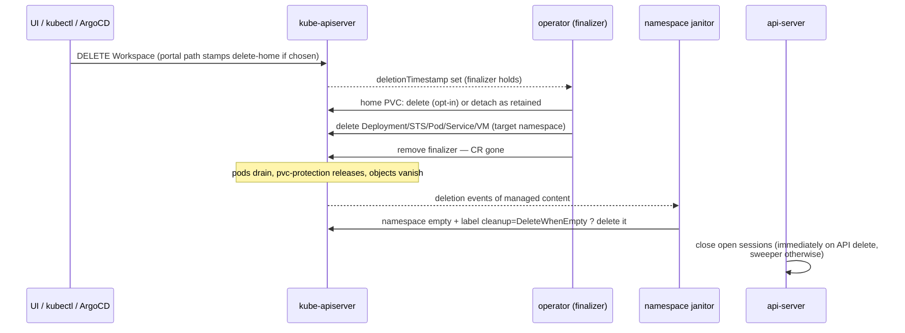

# Workspace deletion — teardown, namespace policy, unblocking

Contract: deleting a `Workspace` destroys **everything** it owned — in the
cluster and in the platform database — except what the user explicitly
chose to keep (the home volume). Deletion behaves identically whatever
triggered it: portal, `kubectl delete`, ArgoCD prune, or a policy TTL.

## Who deletes what

| Resource | Mechanism |
|---|---|
| Deployment / StatefulSet / Pod / Service / VM, same namespace as the CR | ownerReference (native cascade) |
| Same, placed in another namespace | finalizer `waas.xorhub.io/teardown` (ownerReferences cannot cross namespaces) |
| Home PVC | finalizer, applying the user's retention choice (see below) |
| ResourceQuota + NetworkPolicy of a placed namespace | cascade of the namespace itself, never individually |
| Namespace | **namespace janitor** (see below) |
| Session rows (database) | api-server: closed on API deletion + **session sweeper** for kubectl/ArgoCD deletions and lost callbacks |
| Remote-workspace credentials Secret | api-server, on remote deletion |

The namespaced types the operator manages are inventoried in ONE place —
`operator/api/v1alpha1/managed.go` — consumed by the teardown, the
janitor's emptiness check, the zero-orphan e2e test
(`test/smoke/orphans_test.go`) and mirrored by `hack/audit-orphans.sh`.
Adding a resource to the reconciler without registering it there makes
the e2e gate fail.

## Deletion sequence



## Namespace policy

- The template's `placement.cleanup` (`Retain` default, `DeleteWhenEmpty`
  opt-in) is **frozen on the namespace at creation** in the
  `waas.xorhub.io/cleanup` label. The janitor reads the label, never the
  template — deleting a template can no longer silently flip
  DeleteWhenEmpty to Retain.
- The janitor only deletes a namespace that (a) carries the operator's
  managed-by label, (b) is labeled `DeleteWhenEmpty`, (c) is targeted by
  **no** Workspace (terminating ones included), and (d) holds **no**
  waas-managed object — a retained home volume keeps its namespace alive,
  and its later deletion (volumes API) re-triggers the janitor.
- Managed namespaces **without** the cleanup label predate the freeze.
  They are never auto-deleted; `hack/audit-orphans.sh` lists them for a
  human decision.

## Home volume (unchanged contract, restated)

- Portal deletion asks keep (default) vs delete. Keep = the PVC is
  detached as a **retained volume**: still labeled with owner +
  managed-by, still counted against the storage quota, adoptable by a new
  workspace via `spec.homeVolumeName`.
- kubectl/ArgoCD deletions never stamp the opt-in annotation
  (`waas.xorhub.io/delete-home`), so they always retain — GitOps can
  never destroy user data by pruning a Workspace.
- Policy TTL (`lifecycle.maxLifetime`) deletes the volume regardless:
  reclaiming storage is what a TTL is for (announced contract).

## Sessions

Deleting a workspace (or remote workspace) through the API closes its
open session rows immediately. Deletions the API never sees (kubectl,
ArgoCD prune) and lost end-of-session callbacks (wwt crash) are covered
by the **session sweeper** (`WAAS_SESSION_SWEEP_INTERVAL`, default 1m,
0 disables): any open session whose workspace UID / remote ID no longer
exists is closed and audited as `session.orphan_ended`.

## When teardown fails — visibility and unblocking

A failing finalizer is **never silent**: each attempt emits a Warning
event `TeardownFailed` on the CR and sets the `Ready` condition to
`TeardownFailed` with the cause (visible in `kubectl describe workspace`
and on the portal card). Retries continue with backoff; the finalizer is
never removed automatically — that would trade a visible stuck deletion
for a silent leak.

If a workspace stays in `Terminating`:

```sh
kubectl -n <cr-namespace> describe workspace <name>   # read the TeardownFailed cause
# fix the cause (RBAC, API availability, webhook…) — deletion resumes alone
```

Last resort, after confirming what would be leaked (`hack/audit-orphans.sh`
lists it afterwards):

```sh
kubectl -n <cr-namespace> patch workspace <name> --type=merge \
  -p '{"metadata":{"finalizers":null}}'
```

This abandons the remaining cleanup **knowingly**: run
`hack/audit-orphans.sh --clean` right after to reap what the finalizer
could not.

## Auditing orphans

```sh
hack/audit-orphans.sh          # report: orphaned objects, empty managed namespaces, retained volumes
hack/audit-orphans.sh --clean  # also delete orphaned objects and empty DeleteWhenEmpty namespaces
```

The e2e gate (`go test ./test/smoke -run TestZeroOrphansAfterDeletion`,
needs `WAAS_SMOKE_URL` + cluster access) creates, deletes and asserts
zero leftovers for every served protocol.
